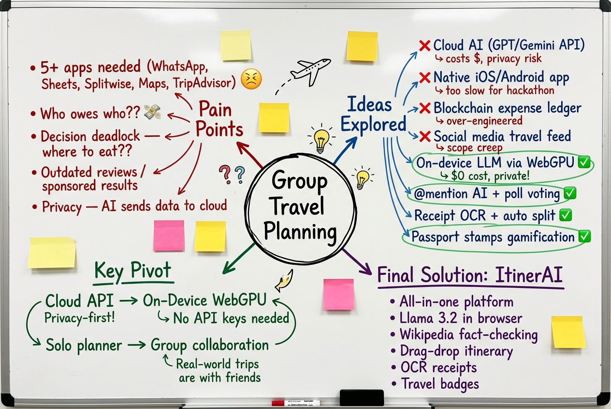
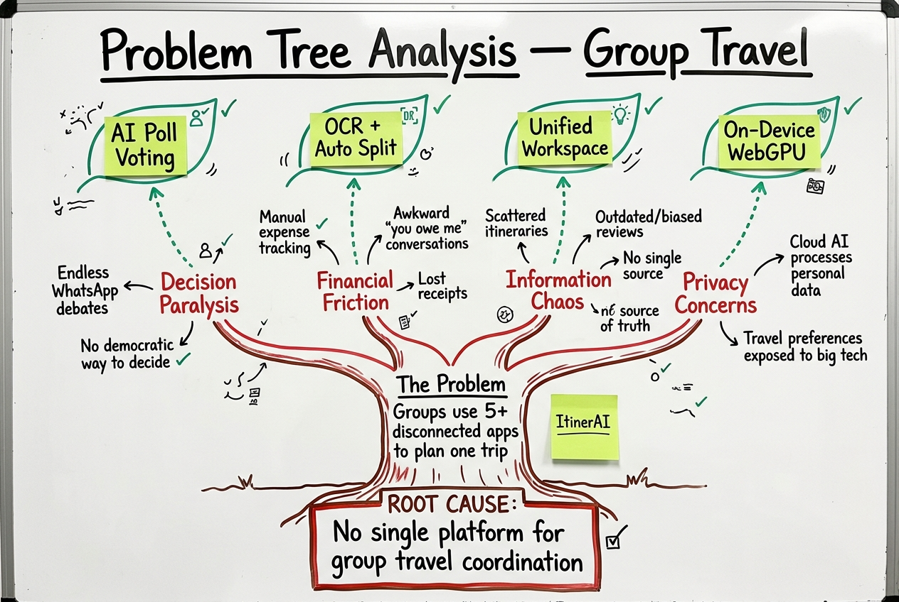
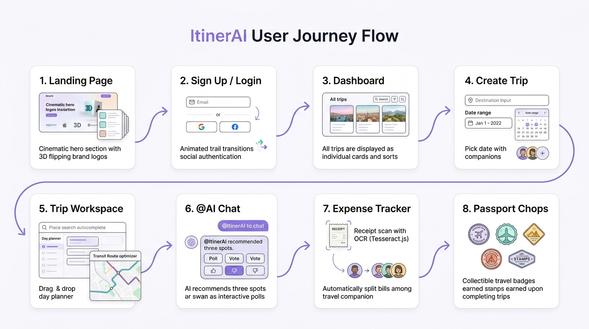
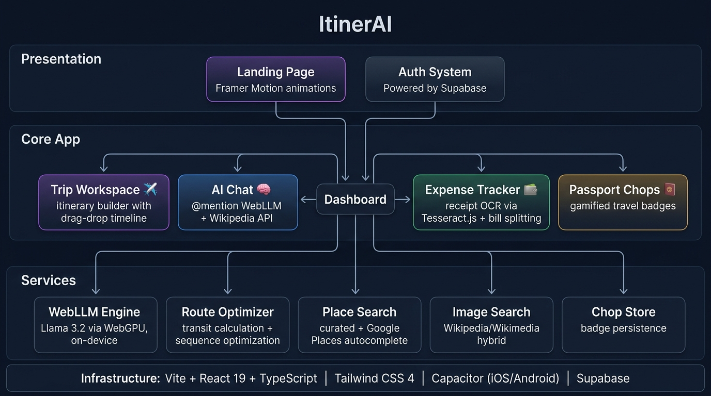

<p align="center">
  
  
  
  
  
  
</p>

<h1 align="center">✈️ ItinerAI — AI-Powered Group Travel Planner</h1>

<p align="center">
  <strong>Plan trips together, powered by on-device AI. No API keys. No cloud costs. Just your browser.</strong>
</p>

<p align="center">
  <a href="#-demo">Demo</a> •
  <a href="#-the-problem">Problem</a> •
  <a href="#-our-solution">Solution</a> •
  <a href="#-features">Features</a> •
  <a href="#%EF%B8%8F-architecture">Architecture</a> •
  <a href="#-getting-started">Getting Started</a>
</p>

---

## 👥 Team

**ItinerAI** by **Team Axiom**

| Member | Role |
|--------|------|
| Kee Wen Fei | Full-Stack Developer |
| Chen Jun Voonn | Full-Stack Developer |


> 📹 **Video Presentation:** \[Unlisted YouTube Link\]
>
> 📑 **Presentation Slides:** [ItinerAI — AI-Powered Group Travel Planner](https://gamma.app/docs/ItinerAI-AI-Powered-Group-Travel-Planner-vkeavomhz97jjtp)

---

## 🎬 Demo

🌐 **Live Demo:** [https://axiom-itinerai.vercel.app](https://axiom-itinerai.vercel.app)

---

## 1. Project Overview

### 🔴 The Problem

Group travel planning is **fragmented, stressful, and inefficient**. When a group of friends decides to travel together, they face:

- **Decision paralysis** — Endless debates over where to eat, what to visit, and how to split costs, scattered across 5+ different apps (WhatsApp, Google Sheets, Splitwise, TripAdvisor, Google Maps).
- **Information overload** — Sifting through hundreds of biased reviews, sponsored listings, and outdated recommendations across multiple platforms.
- **No single source of truth** — Itineraries live in messy shared docs. Expenses are tracked on napkins. Nobody knows the final plan.
- **Privacy concerns with AI** — Existing AI travel tools (ChatGPT, Google Gemini) send your personal travel data to remote servers for processing.

**Existing solutions fall short:**

| App | What it does well | Where it fails |
|-----|------------------|----------------|
| **TripAdvisor** | Crowd-sourced reviews | No itinerary builder, no AI, no expense tracking |
| **Splitwise** | Expense splitting | Zero travel planning features |
| **Wanderlog** | Itinerary planning | No AI chat, no receipt scanning, no collaborative voting |
| **ChatGPT / Gemini** | AI recommendations | Cloud-only (privacy risk), no itinerary integration, hallucinated suggestions |

No single app combines **AI recommendations + collaborative planning + expense tracking + gamification** in one privacy-first experience.

---

### 🟢 Our Solution

**ItinerAI** is an all-in-one group travel planner that runs a **real AI model (Llama 3.2) directly inside your browser** using WebGPU — zero API keys, zero cloud costs, zero data leaving your device.

Group members plan trips together in a shared workspace where they can `@mention` the AI assistant in a group chat to get **Wikipedia-verified destination recommendations** served as **interactive polls** everyone can vote on. The winning spot gets added to a drag-and-drop itinerary with smart route optimization, and all expenses are tracked with **OCR receipt scanning** and **automatic bill splitting**.

#### Feature Set

| Category | Features |
|----------|----------|
| **🤖 On-Device AI Chat** | `@ItinerAI` mention in group chat → Llama 3.2 via WebGPU generates responses → Wikipedia API validates suggestions → 3-option interactive poll with voting |
| **📋 Trip Workspace** | Drag-and-drop day planner · Place search autocomplete with smart autofill (time, cost, category, tips) · Per-day route transit optimizer with efficiency scoring |
| **💰 Expense Tracker** | Camera receipt scanning via Tesseract.js OCR · Automatic bill splitting among companions · Digital receipt generation · Category analytics with pie charts |
| **🛂 Passport Chops** | Gamified collectible travel badges (stamps) earned upon trip completion · Custom SVG chop designs per destination · Shareable travel passport |
| **🔒 Privacy-First AI** | Model runs 100% on-device via WebGPU — no data sent to any server |
| **✈️ Flight & Hotel Search** | Aggregated flight/hotel results with multi-criteria sorting (price, rating, duration, stops) |
| **🎨 Premium Landing Page** | 10-section cinematic landing with Framer Motion animations, 3D flipping logos, scroll-driven stacked cards, and glassmorphism effects |

---

## 2. Ideation & Process

### 2.1 Ideas We Considered

| Idea | Status | Rationale |
|------|--------|-----------|
| **On-device LLM travel assistant via WebGPU** | ✅ Chosen | Privacy-first differentiator — no API keys, no cloud costs, runs Llama 3.2 entirely in-browser. Unique technical innovation that no competitor offers. |
| **@mention AI in group chat with poll voting** | ✅ Chosen | Solves the "where should we eat?" deadlock. AI suggests 3 options → group votes → democratic decision. Naturally collaborative. |
| **Receipt OCR with auto bill-splitting** | ✅ Chosen | Receipt scanning (Tesseract.js) + automatic cost division eliminates the "who owes who" friction that ruins every group trip. |
| **Gamified passport chops (travel badges)** | ✅ Chosen | Retention mechanic inspired by Japanese train station stamps (駅スタンプ). Emotional reward for completing trips drives re-engagement. |
| **Wikipedia-verified recommendations** | ✅ Chosen | Solves LLM hallucination — every AI suggestion is cross-referenced against Wikipedia's open API. Only verified, real places make it into polls. |
| **Route transit optimizer** | ✅ Chosen | Haversine-distance based transit calculator with 1-click sequence optimization. Shows estimated travel time, mode (walk/subway/bus/taxi), and efficiency score per day. |
| Cloud-based LLM (OpenAI / Gemini API) | ❌ Dropped | Requires API keys, costs money per query, sends personal travel data to third-party servers. Against our privacy-first principle. |
| Native mobile app (Swift / Kotlin) | ❌ Dropped | Development time too long for hackathon. Chose Capacitor for cross-platform web-to-native bridge instead. |
| Blockchain-based expense ledger | ❌ Dropped | Over-engineered for the use case. Simple in-memory state with Supabase persistence is sufficient and faster to implement. |
| Social media feed of travel stories | ❌ Dropped | Scope creep — doesn't solve the core problem of group coordination. Passport Chops provides enough social/gamification layer. |

### 2.2 Ideation Boards

Our team used collaborative brainstorming to map out the problem space, explore ideas, and converge on the final solution. Below are the artifacts from our ideation process:

**Brainstorming Mindmap — Exploring the Problem & Ideas:**



**Problem Tree Analysis — Root Cause → Effects → Solutions:**



**User Journey Flow — End-to-End Experience Design:**



---

## 3. Solution Deep Dive

### 3.1 Core Architecture



ItinerAI follows a **layered component architecture** with clear separation between presentation, feature modules, and service layers:

```
src/
├── App.tsx                          # Root router (Landing ↔ Dashboard)
├── components/
│   ├── landing/                     # 10-section cinematic landing page
│   │   ├── Navbar.tsx               # Floating scroll-aware navbar
│   │   ├── HeroSection.tsx          # Jitter hero with CTA
│   │   ├── CardShowcaseSection.tsx   # Infinite marquee cards
│   │   ├── VideoShowcaseSection.tsx  # Video canvas embed
│   │   ├── StackedCardsSection.tsx   # Scroll-driven stacked reveal
│   │   ├── FeaturesBentoSection.tsx  # 2×2 bento feature grid
│   │   └── FooterSection.tsx        # CTA + newsletter + links
│   ├── auth/
│   │   └── AuthPage.tsx             # Email + social auth (Supabase)
│   ├── dashboard/
│   │   ├── DashboardPage.tsx        # Central hub: trips, flights, hotels
│   │   └── DateRangePickerModal.tsx  # Custom calendar range picker
│   ├── itinerary/
│   │   ├── ItineraryView.tsx        # Trip card gallery with filters
│   │   └── TripWorkspace.tsx        # Day planner + drag-drop + route optimizer
│   ├── chat/
│   │   └── TripChatView.tsx         # AI group chat + @mention + polls
│   ├── expenses/
│   │   ├── ExpensesView.tsx         # Expense dashboard + analytics
│   │   ├── ReceiptScannerModal.tsx   # Tesseract.js OCR camera scanner
│   │   ├── BillSplitModal.tsx       # Multi-person bill splitting
│   │   └── DigitalReceiptModal.tsx  # Generated digital receipts
│   ├── profile/
│   │   └── UserProfileView.tsx      # Passport chops + travel stats
│   └── ui/                          # Shared design system components
│       ├── shimmer-button.tsx
│       ├── border-beam.tsx
│       ├── marquee.tsx
│       └── number-ticker.tsx
├── services/
│   ├── webllmService.ts             # On-device LLM (Llama 3.2 via WebGPU)
│   ├── imageSearchService.ts        # Wikipedia/Wikimedia image fetcher
│   ├── placeSearchService.ts        # Place autocomplete + smart autofill
│   ├── routeOptimizer.ts            # Haversine transit + sequence optimization
│   └── chopStore.ts                 # Passport chop badge persistence
└── hooks/
    └── useBodyScrollLock.ts         # Modal scroll lock utility
```

### 3.2 Key Technical Decisions

#### 🧠 On-Device AI with WebLLM + WebGPU

Instead of calling OpenAI/Gemini APIs (which cost money and leak user data), we run **Meta's Llama 3.2 1B Instruct** directly in the browser via [WebLLM](https://github.com/mlc-ai/web-llm):

```
User types "@ItinerAI best restaurants in Kyoto"
  → WebLLM engine generates response using WebGPU acceleration
  → Wikipedia API validates mentioned places are real
  → Regex parser extracts 3 verified spots
  → UI renders interactive poll cards with vote buttons
```

**Why this matters:**
- **$0 inference cost** — no API billing, works offline after initial model download
- **Zero latency to cloud** — model runs on user's GPU
- **Complete privacy** — travel preferences never leave the device
- **No API key management** — works out of the box

#### 🔍 Wikipedia-Verified Recommendations (Anti-Hallucination)

LLMs hallucinate. To counter this, every AI-generated travel recommendation is cross-referenced against **Wikipedia's open search API**:

1. User query is cleaned of filler words → core keywords extracted
2. Wikipedia API returns top 8 results for `{destination} {keywords}`
3. Results are filtered through `isValidTravelSpot()` — removes movies, albums, politicians, disambiguation pages, and other non-travel entities
4. Only verified place names are fed back to the LLM as grounding context
5. An intent-aware fallback (`getSmartFallbackResponse`) provides curated high-quality recommendations when the LLM output is insufficient

#### 📸 Receipt OCR with Tesseract.js

The expense tracker uses **Tesseract.js v7** to scan physical receipts:
- Camera capture or file upload
- On-device OCR processing (no cloud API)
- Automatic extraction of merchant name, total, date, and line items
- One-tap bill splitting among travel companions

#### 🗺️ Route Transit Optimizer

The itinerary's route optimizer uses **Haversine distance calculation** with a landmark coordinate dictionary to:
- Calculate transit time and mode (walk/subway/train/bus/taxi/ferry) between activities
- Score daily route efficiency (0–100)
- Offer **1-click sequence optimization** that reorders activities to minimize total travel time
- Show estimated time savings after optimization

---

## 4. Tech Stack

| Layer | Technology | Purpose |
|-------|-----------|---------|
| **Framework** | React 19 + TypeScript 6.0 | Component architecture with strict typing |
| **Build** | Vite 8 | Lightning-fast HMR and optimized production builds |
| **Styling** | Tailwind CSS 4 | Utility-first responsive design system |
| **Animation** | Framer Motion 13 | Page transitions, gesture-driven interactions, layout animations |
| **AI / LLM** | WebLLM + Llama 3.2 1B | On-device language model via WebGPU |
| **OCR** | Tesseract.js 7 | Client-side optical character recognition for receipts |
| **Auth & DB** | Supabase | Authentication (email + social) and real-time database |
| **Data Fetching** | TanStack React Query 5 | Server state management with caching and deduplication |
| **Cross-Platform** | Capacitor 8 | Web → iOS/Android native bridge |
| **External APIs** | Wikipedia / Wikimedia (free, open, no keys) | Destination verification + image sourcing |

---

## 5. Getting Started

### Prerequisites

- **Node.js** ≥ 18
- **npm** ≥ 9
- A browser with **WebGPU support** (Chrome 113+, Edge 113+) for AI features

### Installation

```bash
# Clone the repository
git clone https://github.com/TeddyHuZz/itinerai.git
cd itinerai

# Or visit the live demo at https://axiom-itinerai.vercel.app

# Install dependencies
npm install

# Start the development server
npm run dev
```

The app will be available at `http://localhost:5173`.

### Build for Production

```bash
npm run build
npm run preview
```

### Environment Variables

Create a `.env` file in the root directory (optional — app works without it using demo mode):

```env
VITE_SUPABASE_URL=your_supabase_url
VITE_SUPABASE_ANON_KEY=your_supabase_anon_key
```

---

## 6. What Makes ItinerAI Different

| Capability | ItinerAI | TripAdvisor | Wanderlog | Splitwise | ChatGPT |
|-----------|----------|-------------|-----------|-----------|---------|
| On-device AI (no cloud) | ✅ | ❌ | ❌ | ❌ | ❌ |
| Group chat with AI @mention | ✅ | ❌ | ❌ | ❌ | ❌ |
| Interactive poll voting | ✅ | ❌ | ❌ | ❌ | ❌ |
| Drag-and-drop itinerary | ✅ | ❌ | ✅ | ❌ | ❌ |
| Receipt OCR scanning | ✅ | ❌ | ❌ | ❌ | ❌ |
| Auto bill splitting | ✅ | ❌ | ❌ | ✅ | ❌ |
| Route optimization | ✅ | ❌ | ✅ | ❌ | ❌ |
| Gamified travel badges | ✅ | ✅ | ❌ | ❌ | ❌ |
| Privacy-first (zero data leak) | ✅ | ❌ | ❌ | ❌ | ❌ |
| No API keys required | ✅ | N/A | N/A | N/A | ❌ |

---

## 7. Future Roadmap

- [ ] **Real-time multiplayer** — Supabase Realtime for live collaborative editing
- [ ] **Offline mode** — Service worker + IndexedDB for full offline capability
- [ ] **Larger LLM models** — Upgrade to Llama 3.2 3B/8B as WebGPU memory improves
- [ ] **Google Maps integration** — Live transit directions and embedded maps
- [ ] **Currency converter** — Real-time exchange rates for multi-currency expense tracking
- [ ] **Export to PDF** — One-click itinerary export for offline access

---

## 📄 License

This project was built for the **Codenection 2026 Hackathon**.

---

<p align="center">
  Built with ❤️ and WebGPU by the ItinerAI team
</p>
