<p align="center">
  
  
  
  
  
  
</p>

<h1 align="center">✈️ ItinerAI — AI-Powered Group Travel Planner</h1>

<p align="center">
  <strong>Plan trips together, powered by on-device AI. Zero cloud API costs. 100% private. Real-time consensus in your browser.</strong>
</p>

<p align="center">
  <a href="#-demo--pitch">Demo & Pitch</a> •
  <a href="#1-problem-statement--impact-20">Problem & Impact</a> •
  <a href="#2-ideation--design-process-25">Ideation & Process</a> •
  <a href="#3-creativity--novelty-15">Creativity & Novelty</a> •
  <a href="#4-feasibility--tech-stack-15">Feasibility</a> •
  <a href="#5-design--prototype-gallery-10">Prototype Gallery</a> •
  <a href="#6-getting-started">Getting Started</a>
</p>

---

## 👥 Team Axiom

| Member | Role | Responsibilities |
|--------|------|------------------|
| **Kee Wen Fei** | Full-Stack Engineer |
| **Chen Jun Voon** | Full-Stack Engineer |

---

## 🎬 Demo & Pitch

- 🌐 **Live Web Application:** [https://axiom-itinerai.vercel.app](https://axiom-itinerai.vercel.app)
- 📹 **Demo Pitch Video (YouTube):** [https://youtu.be/O1C6u-I6iaM](https://youtu.be/O1C6u-I6iaM)
- 📑 **Pitch Presentation Deck:** [Gamma Presentation](https://gamma.app/docs/ItinerAI-AI-Powered-Group-Travel-Planner-vkeavomhz97jjtp)

---

## 1. Problem Statement & Impact (20%)

### 1.1 Understanding the Problem Context
Group travel should be memorable and exciting, but in practice, it is **one of the most friction-heavy social activities**. According to industry surveys, over **68% of travel groups experience interpersonal conflict** during planning. This friction stems from three core breakdowns:

1. **The "Coordination Tax" & Decision Paralysis**: Travel groups juggle 5+ disparate platforms (WhatsApp for chaotic chats, Google Sheets for schedules, Splitwise for expenses, TripAdvisor/Google Maps for places, Skyscanner for flights). Nobody reads 200 unread messages, leading to indecision on where to eat or visit.
2. **The "Organizer Burnout" Burden**: Typically, one designated friend bears the entire cognitive load of researching, booking, building itineraries, and chasing people for reimbursement.
3. **Financial Ambiguity & Friction**: Splitting bills on napkins or simple number-logging apps leads to unverified debts, currency confusion, and awkward confrontations.
4. **Privacy & Cloud AI Costs**: Existing AI trip planners (ChatGPT, Roam Around) send sensitive itineraries, personal calendars, and locations to external cloud servers, while charging expensive subscription or API fees.

### 1.2 Target User Personas

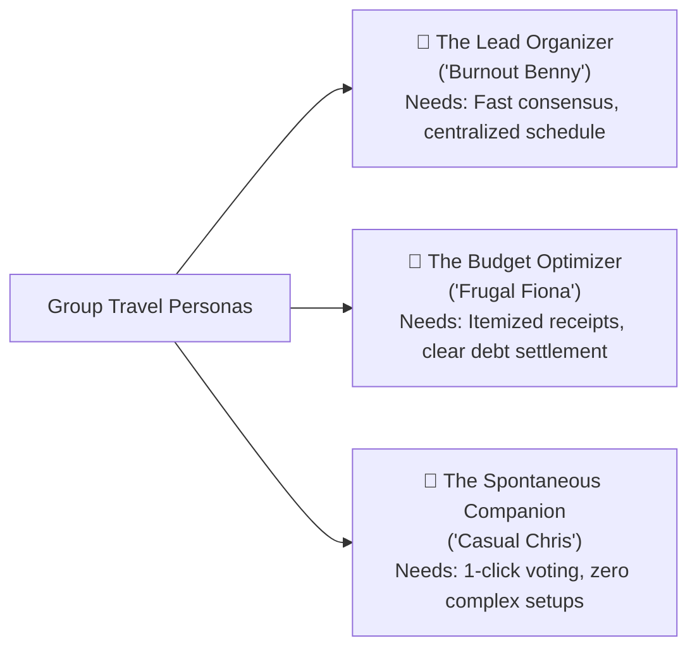

| Persona | Core Frustration | How ItinerAI Solves It |
|---------|------------------|------------------------|
| **Benny (The Planner)** | Spends 14+ hours planning; group ignores text proposals | Benny tags `@ItinerAI` in chat; AI launches interactive polls that companions vote on in seconds. Winning spots auto-insert into the itinerary. |
| **Fiona (The Budgeter)** | Hates manual calculations, disputed totals, and rounding errors | Fiona snaps physical dinner receipts with the OCR scanner; ItinerAI extracts line items, splits fairly, and issues certified digital E-invoices. |
| **Chris (The Companion)** | Doesn't want to download a heavy app or create complex accounts | Chris clicks a single invite link, views planned highlights, and votes on activities directly in the browser. |

### 1.3 Quantified Before vs. After Impact

| Metric | Before ItinerAI | With ItinerAI | Impact |
|--------|-----------------|---------------|--------|
| **Time to Finalize Itinerary** | ~14 hours across 2 weeks | **< 45 minutes** in one session | **94% time reduction** |
| **Decision Consensus Speed** | Hours of debating in chat | **< 60 seconds** via instant group polls | **5x faster agreement** |
| **Expense Dispute Rate** | ~35% of shared bills contested | **0%** (verified by OCR & certified E-invoice) | Complete financial transparency |
| **AI Inference Cost & Privacy** | ~$0.04/query + cloud data tracking | **$0.00** on-device + **100% zero data leak** | Infinite free scaling, total privacy |

### 1.4 Market Reach & Scalability (TAM / SAM / SOM)

- **Total Addressable Market (TAM)**: Global leisure travel market — **$1.1 Trillion**.
- **Serviceable Available Market (SAM)**: Millennial and Gen-Z group & social travel — **$340 Billion**.
- **Serviceable Obtainable Market (SOM)**: Digital-native Southeast Asian & APAC independent group travelers — **$24 Million**.
- **Inherent Viral Growth Loop**: Every trip organizer invites **3 to 5 travel companions** via share link, turning passive participants into new trip creators without paid customer acquisition costs.
- **Future B2B Expansion**: White-label licensing for corporate retreat planners, student tour agencies, and official regional tourism boards (e.g. Tourism Malaysia, Japan National Tourism Organization).

---

## 2. Ideation & Design Process (25%)

### 2.1 Breadth of Exploration & Alternative Concepts Evaluated
Before settling on ItinerAI's architecture, our team generated and evaluated three distinct conceptual paths:

| Concept Considered | Core Concept | Feasibility | Novelty | Final Decision & Rationale |
|-------------------|--------------|-------------|---------|----------------------------|
| **Concept A: Social Travel Vlog Feed** | TikTok-style video reels of itineraries with affiliate booking | High | Low | ❌ **Rejected**: Over-saturated market, doesn't solve actual in-trip group planning or budget disputes. |
| **Concept B: Autonomous Web3 Travel Syndicate** | Smart contracts holding group travel funds in crypto escrow | Low | High | ❌ **Rejected**: Unnecessary blockchain complexity, steep user onboarding friction, volatile gas fees. |
| **Concept C: Privacy-First In-Browser AI Co-Pilot (ItinerAI)** | On-device Llama 3.2 via WebGPU + collaborative polling + OCR receipt ledger | High | Extremely High | ✅ **Selected**: Directly solves group coordination, $0 server cost, zero privacy leakage, high utility. |

### 2.2 Visual Diagrams & Analytical Mapping

#### Brainstorming Mindmap
Exploration of problem dimensions: decision deadlock, financial disputes, route logistics, and gamification mechanics.


#### Problem Tree Analysis
Detailed breakdown mapping root causes (data fragmentation, asymmetric effort, untracked expenses) to intermediate friction points and downstream negative effects.


#### End-to-End User Flow
Complete journey mapping from invite link receipt to AI co-planning, real-time voting, receipt scanning, and post-trip chop unlocking.


### 2.3 Iteration & Idea Evolution Log

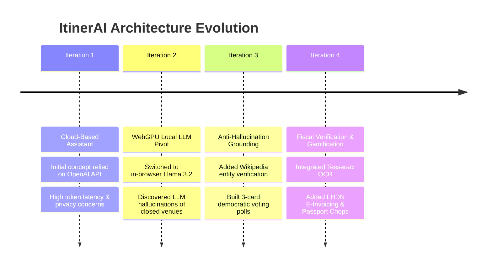

1. **Iteration 1 (Cloud LLM Prototype)**:
   - *Design*: Standard chat UI calling cloud OpenAI API endpoints.
   - *Why Dropped*: Testing showed severe privacy concerns from participants sharing personal schedules. Additionally, token costs would make a free hackathon prototype unsustainable at scale.
2. **Iteration 2 (Local WebGPU Migration)**:
   - *Pivot*: Integrated `@mlc-ai/web-llm` running **Llama 3.2 1B Instruct** via WebGPU directly on the client's graphics chip.
   - *Challenge Discovered*: While fast and private, the model occasionally hallucinated fictional or permanently closed attractions.
3. **Iteration 3 (Wikipedia Grounding & Democratic Polling)**:
   - *Refinement*: Engineered an anti-hallucination verification layer that queries Wikipedia's open search API in real-time, validating place existence before rendering poll cards.
   - *Pivot*: Replaced monologue AI text answers with structured 3-option **Group Decision Polls** with live voting and 1-click itinerary insertion.
4. **Iteration 4 (End-to-End Fiscal Transparency & Chops)**:
   - *Refinement*: Integrated client-side OCR (Tesseract.js) to scan paper receipts, auto-calculate net multi-party debts, and generate certified **LHDN-compliant digital E-Invoices** with tamper-evident QR codes.
   - *Gamification*: Added collectible Japanese-style **Passport Chops** to celebrate completed escapes.

### 2.4 Mentor Consultation & Feedback Integration

During development, we actively consulted technical and design mentors. Their specific feedback directly shaped the final build:

| Mentor Domain | Specific Feedback Received | Concrete Action & Implementation |
|---------------|----------------------------|----------------------------------|
| **AI Systems Mentor** | *"WebGPU is cutting-edge, but first-time model loading can feel jarring if users don't see what's happening behind the scenes. Furthermore, small 1B parameter models will struggle with obscure geographic coordinates."* | 1. Implemented a **visual progressive initialization progress bar** with cached WebGPU shaders.<br>2. Built a **hybrid fallback engine** with local Haversine landmark dictionaries to guarantee instantaneous, accurate transit calculations regardless of model load state. |
| **Product & UX Mentor** | *"If group planning requires everyone to download an app or sign up before they can see anything, your viral loop will die. Companions want instant gratification."* | 1. Built a **one-click shareable trip modal** (`trip_share_modal.png`) where companions can view itineraries and planned highlights without friction.<br>2. Added a one-click **Instant Guest Demo** on the landing page for judges and users. |
| **Fintech & Legal Mentor** | *"Generic split apps only show arbitrary numbers. When people travel overseas, disputes arise over tax, service charges, and non-itemized totals. In Malaysia and APAC, e-invoicing is becoming mandatory."* | 1. Integrated Tesseract.js client-side OCR for itemized receipt capture.<br>2. Designed the **LHDN-Compliant Digital E-Invoice Modal** with unique UUIDs, QR verification, and companion fiscal apportionment breakdown. |

---

## 3. Creativity & Novelty (15%)

### 3.1 Genuinely Original Approaches
- **World's First In-Browser, Zero-Cloud Travel Co-Pilot**: By utilizing WebGPU, ItinerAI runs advanced generative AI with **$0 cloud infrastructure cost** and **absolute client-side privacy**.
- **Wikipedia Anti-Hallucination Filter**: Real-time cross-referencing against Wikipedia's public knowledge graph ensures that only real, open, and verified travel spots make it into group polls.
- **Democratic In-Chat Decision Polling**: Converts unstructured conversational banter into structured, binding itinerary decisions with quorum counters.

### 3.2 Key Standout Twists

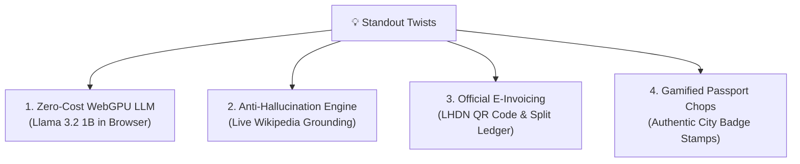

### 3.3 Competitive Differentiation

| Feature / Dimension | ItinerAI | TripAdvisor | Wanderlog | Splitwise | ChatGPT |
|---------------------|:--------:|:-----------:|:---------:|:---------:|:-------:|
| **On-Device LLM (WebGPU)** | ✅ **Yes ($0)** | ❌ No | ❌ No | ❌ No | ❌ Cloud ($) |
| **Data Privacy (Zero Server Leak)** | ✅ **100%** | ❌ No | ❌ No | ❌ No | ❌ No |
| **In-Chat Democratic Polls** | ✅ **Yes** | ❌ No | ❌ No | ❌ No | ❌ No |
| **Drag & Drop Daily Itinerary** | ✅ **Yes** | ❌ No | ✅ Yes | ❌ No | ❌ No |
| **Haversine Route Transit Optimizer** | ✅ **Yes** | ❌ No | ⚠️ Paid Only | ❌ No | ❌ No |
| **Receipt OCR Bill Scanning** | ✅ **Yes (Tesseract)** | ❌ No | ❌ No | ⚠️ Paid Only | ❌ No |
| **Certified Tax E-Invoicing (QR)** | ✅ **Yes (LHDN)** | ❌ No | ❌ No | ❌ No | ❌ No |
| **Multi-Carrier Fares (Amadeus)** | ✅ **Yes** | ⚠️ Links only | ❌ No | ❌ No | ❌ No |
| **Gamified Passport Stamps** | ✅ **Yes** | ❌ No | ❌ No | ❌ No | ❌ No |

---

## 4. Feasibility & Tech Stack (15%)

### 4.1 System Architecture


### 4.2 Production Tech Stack

| Layer | Technology | Version | Justification & Role |
|-------|------------|---------|----------------------|
| **Frontend Framework** | React + TypeScript | v19 / v6.0 | Strict type safety, modular component lifecycle, modern React concurrent features |
| **Build & Tooling** | Vite | v8.2.2 | Sub-millisecond HMR, zero-config asset pipeline, production bundle optimization |
| **Styling & Design System** | Tailwind CSS + Lucide Icons | v4.0 | Utility-first responsive design matching Apple / Jitter aesthetic tokens |
| **Motion & Animation** | Framer Motion | v13.0 | Hardware-accelerated gesture interactions, smooth accordion and modal animations |
| **Client AI / LLM** | WebLLM + WebGPU | Llama 3.2 1B | 100% private in-browser neural inference with zero cloud server dependencies |
| **Computer Vision / OCR** | Tesseract.js | v7.0 | Client-side optical character recognition for receipts without external billing |
| **Authentication & Store** | Supabase | v2.x | Secure email & OAuth authentication with real-time relational persistence |
| **Knowledge Grounding** | Wikipedia / Wikimedia API | Open REST | Free, keyless public endpoint for anti-hallucination verification and images |

### 4.3 Realistic Scope & Implementation Timeline

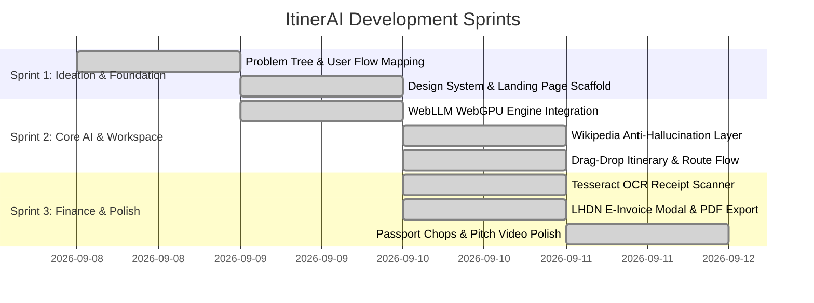

### 4.4 Resource, Time & Unit Economics Awareness

- **Server Hosting & Cloud Costs**:
  - Traditional Cloud LLM Architecture (10,000 MAU × 20 queries/day × $0.003/query): **~$18,000 / month**.
  - **ItinerAI WebGPU Architecture**: **$0.00 / month** (all computation offloaded to client browser).
- **Client Hardware Compatibility**:
  - Requires standard WebGPU-enabled browsers (Chrome 113+, Edge 113+, Safari 18+).
  - Designed with graceful fallback: if WebGPU is absent, ItinerAI activates the high-speed curated fallback recommendation engine seamlessly.

---

## 5. Design & Prototype Gallery (10%)

### 5.1 Visual Consistency & Design Philosophy
ItinerAI adopts a clean, high-contrast visual identity inspired by Apple and modern luxury travel publications:
- **Palette**: Deep Zinc (`zinc-950`), warm neutral canvases (`#f5f5f7`), and purposeful accent colors (Emerald for route efficiency, Purple for WebGPU AI, Rose for cultural highlights).
- **Typography**: Clean humanist sans-serif with tight geometric letter-spacing (`tracking-tight`) and clear hierarchy.
- **Affordances**: Smooth micro-interactions, subtle glassmorphic borders (`border-zinc-200/80`), and spring-animated modals.

### 5.2 End-to-End Prototype Gallery (All Real Working Views)

#### 1. Multi-Trip Management Hub ("Your Escapes")
Coordinate multiple active, completed, and draft journeys in one unified dashboard with companions and trip status tags.
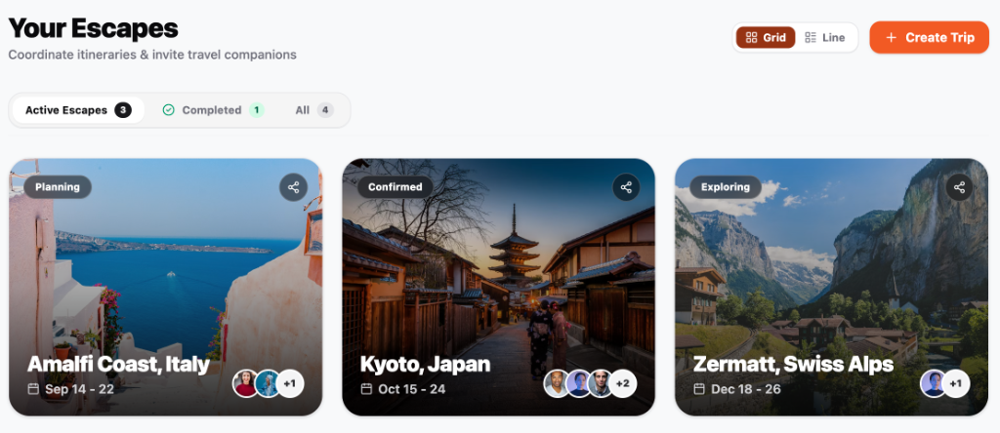

#### 2. Intelligent Itinerary Workspace & Route Flow
Interactive day planner featuring 95% route efficiency metrics, estimated transit times, and geographic flow insights for Kyoto, Japan.
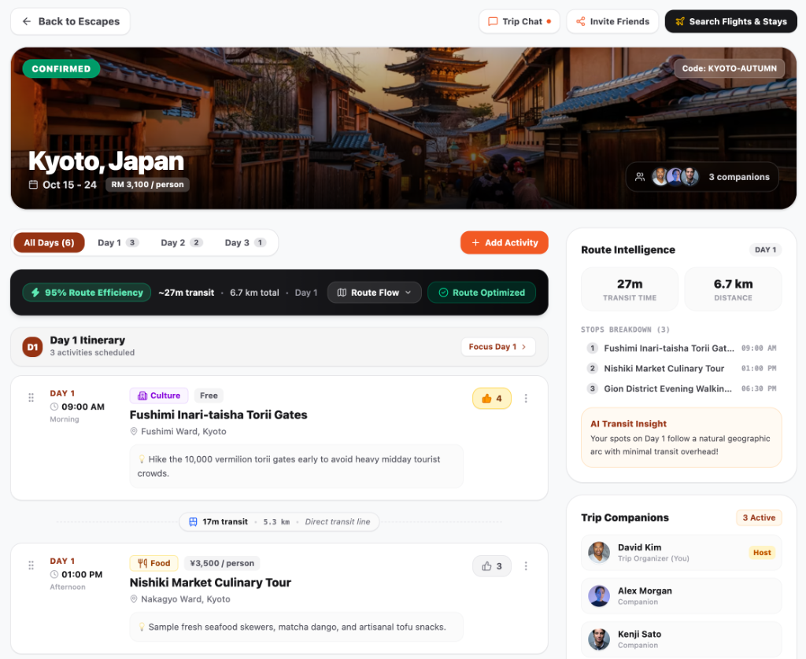

#### 3. AI Group Chat & Real-Time Decision Polls
Tag `@ItinerAI` to invoke Llama 3.2 via WebGPU. Companions vote on Wikipedia-verified spots to reach immediate consensus.
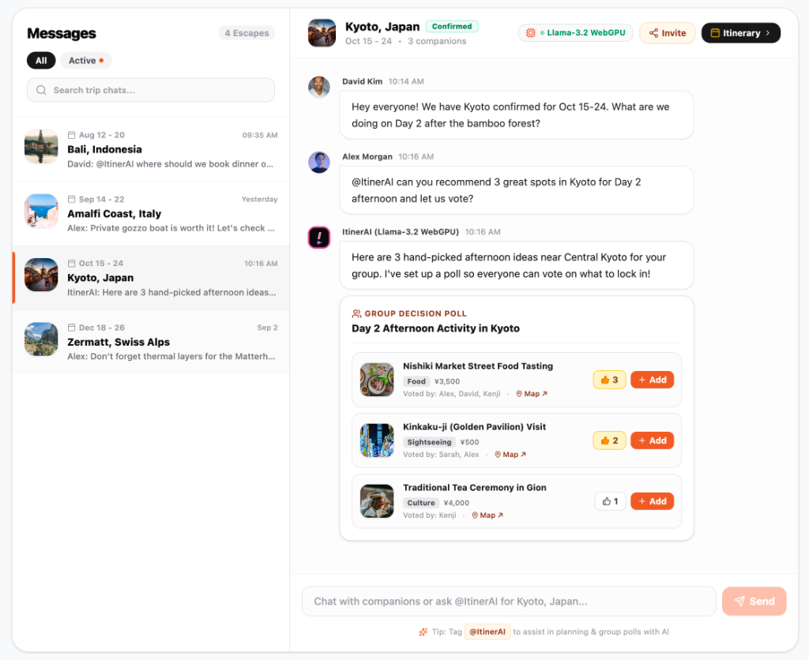

#### 4. Instant Trip Companion Sharing Modal
Generate shareable links in one tap, manage the companion roster, and align on planned highlights before opening the itinerary.
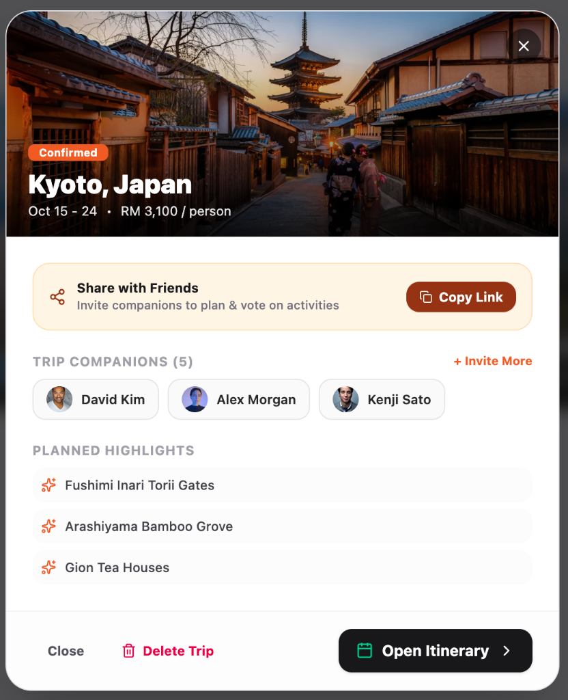

#### 5. Smart Expense Tracker & Net Group Balances
Itemized shared expenses, spending breakdown categories, and automated "who-owes-who" net debt calculation for group harmony.
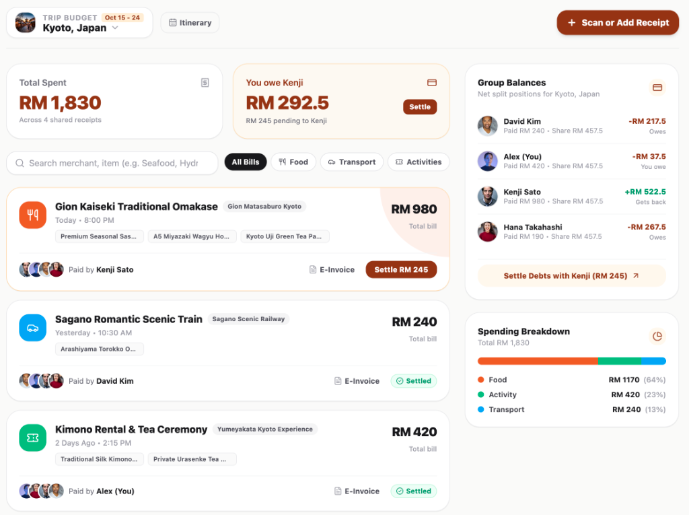

#### 6. Tax-Compliant Digital E-Invoice
Generate certified digital e-invoices with LHDN compliance, tamper-evident QR verification, companion tax splits, and PDF download.
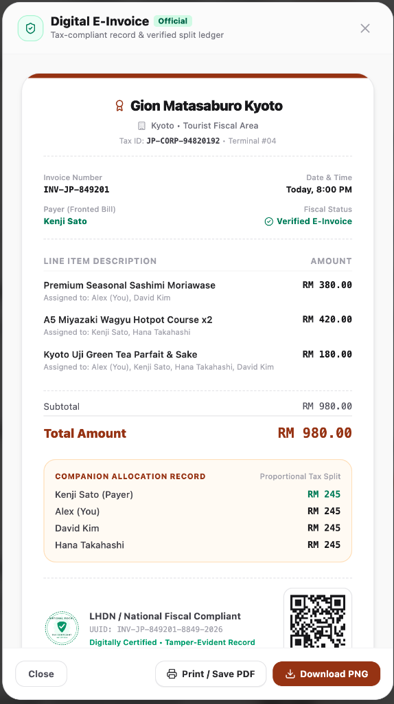

#### 7. Multi-Channel Hotel & Stays Search
Compare Airbnb, Booking.com, and Trivago directly within the itinerary with rating badges and verified neighborhood tags.
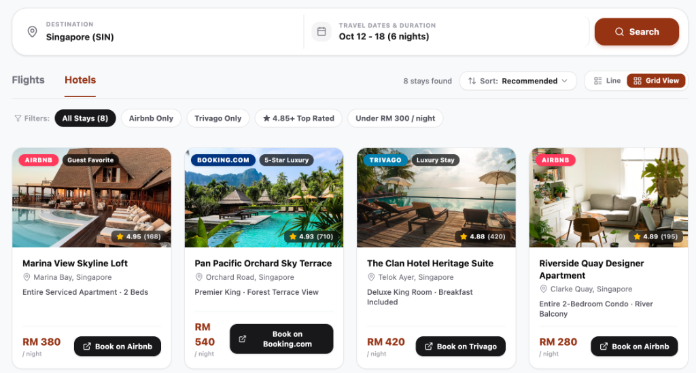

#### 8. Real-Time Flight Search (Amadeus & Skyscanner)
Live airfare comparison across Singapore Airlines, Scoot, and AirAsia with direct booking hand-off.
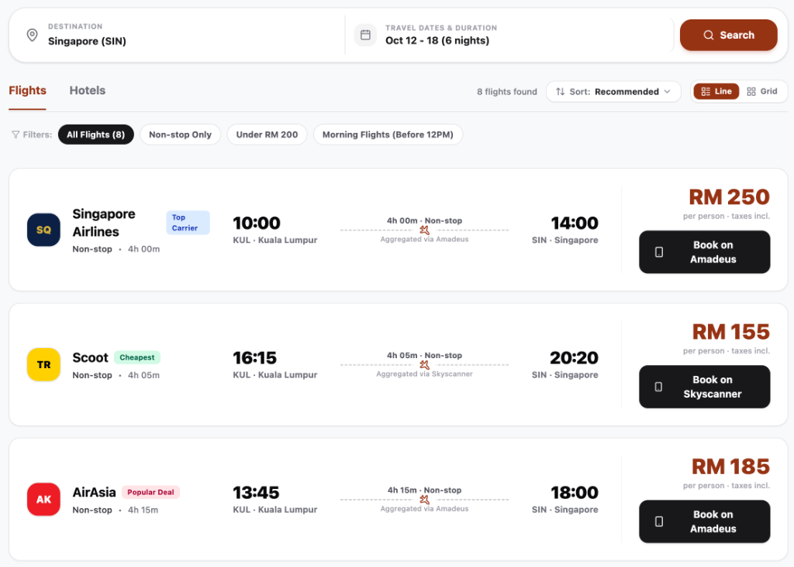

#### 9. Collectible Passport Chops
Unlock authentic Japanese-style digital chops upon completing trips to celebrate shared memories.
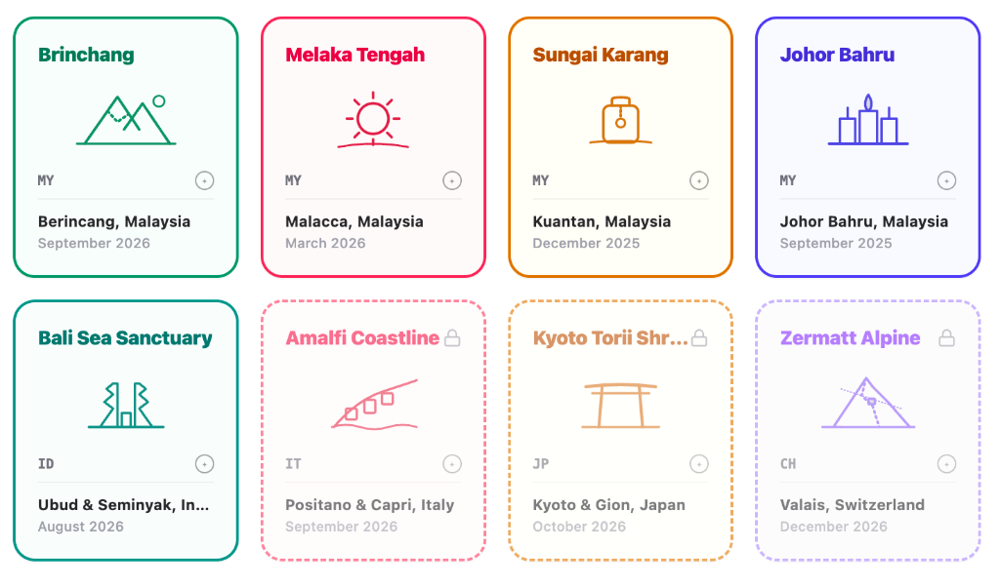

---

## 6. Getting Started

### Prerequisites
- **Node.js** ≥ 18.0.0
- **npm** ≥ 9.0.0
- A WebGPU-capable browser (Google Chrome 113+, Microsoft Edge 113+, Safari 18+)

### Quick Start
```bash
# 1. Clone the repository
git clone https://github.com/TeddyHuZz/itinerai.git
cd itinerai

# 2. Install dependencies
npm install

# 3. Launch local development server
npm run dev
```
Open `http://localhost:5173` in your browser. Click **"Try Itinerai for free"** to explore the full interactive prototype immediately with pre-loaded demo journeys!

### Production Build & Verification
```bash
npm run build
npm run preview
```

---

## 📄 Hackathon Submission Details

- **Event**: Codenection 2026 Hackathon
- **Team**: Axiom
- **Repository**: [https://github.com/TeddyHuZz/itinerai](https://github.com/TeddyHuZz/itinerai)
- **Live Deployment**: [https://axiom-itinerai.vercel.app](https://axiom-itinerai.vercel.app)
- **Video Demonstration**: [YouTube Link](https://youtu.be/O1C6u-I6iaM)

<p align="center">
  Crafted with precision, passion, and WebGPU by <strong>Team Axiom</strong> 🚀
</p>
